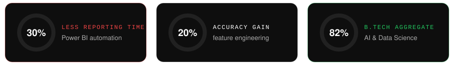
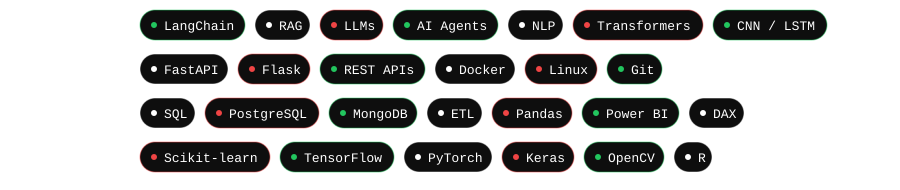
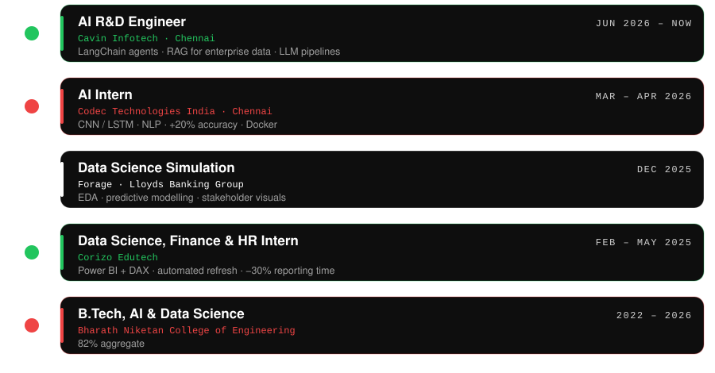

<div align="center">


<br>

<a href="https://venkateshwaran-0a7i.github.io/Venkateshwaran_Mani_Portfolio/"></a>
<a href="https://www.linkedin.com/in/venkateshwaran-m-a3b2b23a3/"></a>
<a href="mailto:venkateshwaran0720@gmail.com"></a>

</div>


AI R&D engineer at **Cavin Infotech**, working where data, engineering and business outcomes meet. I build Generative AI apps, AI agents and RAG systems, backed by clean Python pipelines and containerized deployments.

📍 Madurai, Tamil Nadu, India




```text
building   →  LLM apps, AI agents (LangChain), RAG pipelines
learning   →  production AI architecture, FastAPI, agentic workflows
open to    →  AI / GenAI engineering roles and R&D collaborations
```


<table>
<tr>
<td><a href="https://github.com/Venkateshwaran-0a7i/Wallet-Scholer"></a></td>
<td><a href="https://github.com/Venkateshwaran-0a7i"></a></td>
</tr>
<tr>
<td><a href="https://github.com/Venkateshwaran-0a7i"></a></td>
<td><a href="https://github.com/Venkateshwaran-0a7i"></a></td>
</tr>
<tr>
<td colspan="2" align="center"></td>
</tr>
</table>


<div align="center">




</div>





<div align="center">


<br>

<sub>Research · Build · Break · Learn · Repeat</sub>

</div>


